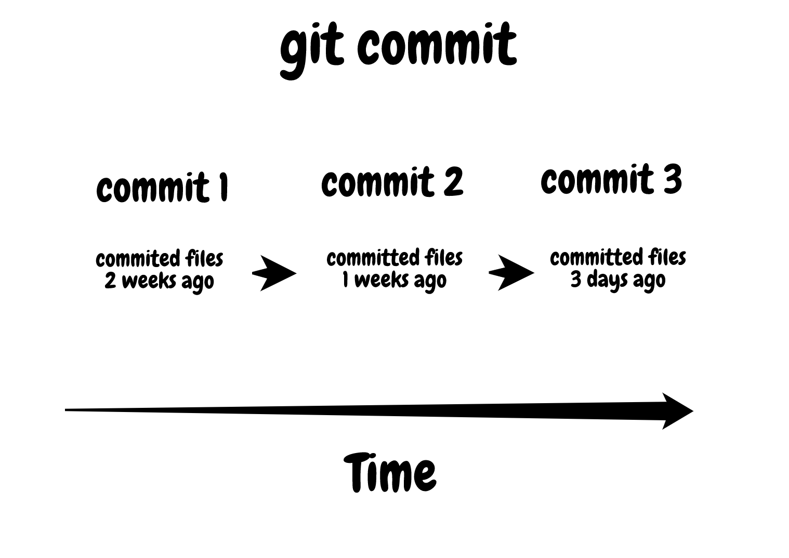
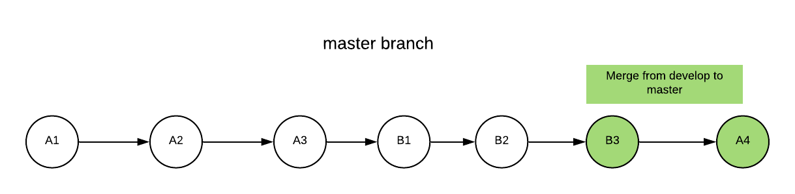
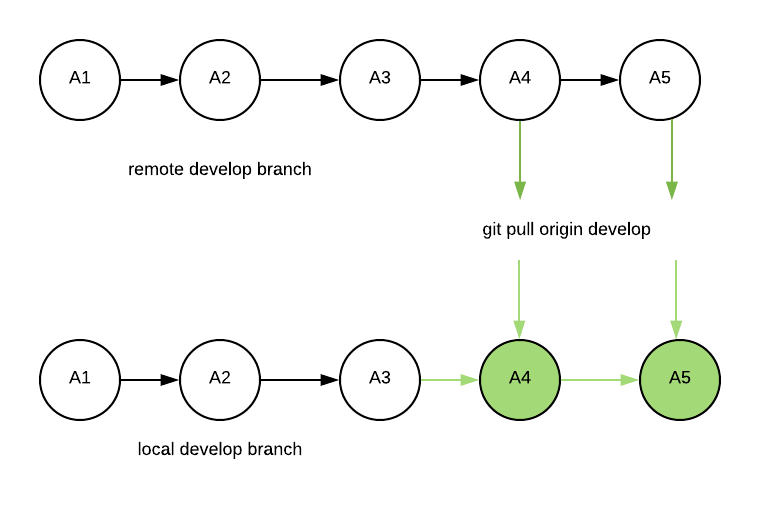

Welcome to the magical world of version control! If there is one tool I had to choose to aid me in my software adventures, it would be GIT.

Why?

1. **GIT saves your butt** when your code goes on fire.
2. **GIT enables collaboration** among your coding peers.
3. **GIT brings peace** to your life, if done right!

I'd like to introduce you to some of the most important GIT commands, assuming little to no prior experience, as well as make it super easy to harness its power.

I remember my first encounter thinking...

### GIT is scary at first

Oh where to start?! There's pushing, there's pulling, there's staging, there's merging, and don't get me started on rebasing (will be covered in future posts).

Well, I'm here to help simplify this for you!

# GITing Started

Let's assume you already have Git installed locally. If so, you can `cd` to a directory of your choosing, and type

```
git init
```

This will initialize a local git repo to work in.

Now, lets enter the ring!

## Round 1: Snapshotting your code to history

The first concept to understand is this:

Git saves specific snapshots of your code in a few different ways. The first is with a **commit**.

### git commit

A **commit** is simply put the state of your committed files when you **commit** it. So every time you commit over time, the state of your files are saved at that time point.



When you commit files, Git will commit all files that are **_staged_** for a commit.

How do you stage files so they can be committed? How do you choose, what files would I like to save in my Git history?

This is done with `git add`.

### git add

Example: Say you have 3 files in your directory: `file1.js`, `file2.js`, and `file3.js`. Now you make changes to `file1.js` and `file2.js` and save the files.

Git will notice that you've made changes to these files (as shown with `git status`).

Now, you want to **commit** these files so Git will save the state of those files in it's history. You do this with the following:

#### Add the files

```
git add file1.js file2.js
```

or, to add all the files that have changed (since the last commit), you would do:

```
git add .
```

Now that you have added these files, they are now **staged** for a **commit**. So you can always pick and choose, which files would I like to stage for this commit with `git add`.

##### Side Note

Under the hood, git will keep track of every file in the directory which you have initialized it, and it will sense whether you made changes to a file or not. You can see this with `git status`. If you would like to have git unaware of certain files in your directory (e.g. `.env` files), add that file to a `.gitignore` file in your directory.

### Commit the files

```
git commit -m 'A COMMIT MESSAGE DESCRIBING WHAT CHANGES YOU MADE'
```

This will now save all the staged files in a `commit` that you can always look back upon in the future. How awesome is that! It **WILL** save you someday.

The message you write after `-m` is up to you, some companies follow a message template to easily understand what a commit is referring to. For example, [conventional commits](https://www.conventionalcommits.org/en/v1.0.0/).

The below displays the workflow for adding and commiting.


How is this powerful?

The power is in that every time you make changes to your files within the git workspace locally, you can add those files and commit them so that you can always go back and see the state of those files whenever you want.

You can even see detailed visuals of which lines of code changed over time.

Personally, I'd say the more commits, the more you get out of GIT.

## Round 2: Branches

When you make a series of commits in git, these commits are made within a **branch**. You can think of a branch as a line that holds a chronological set of commits like this:


Where A1, A2, and A3 each represent one commit after the other in the same branch.

### What branch am I on?

```
git branch
```

What is great about branches is you can **branch off** from this branch, and name it whatever you like. Like this...

### Creating another branch

```
git checkout -b develop
```


In this example, the branch we started from is called **master**, and we just created another branch called **develop** and then moved to that branch.

The `-b` is simply used to create a new branch. If you already created the branch, you can omit the `-b`.

This is another powerful feature of Git because you can essentially organize your commits into different branches. Where each branch can represent new features, bug fixes, production ready code, etc.

In this example, imagine you made 3 more commits in branch develop - B1, B2, and B3.

When you are done with a branch of work, you can merge it back in to your original branch like so...

### Merging branches together

1. Go to the target branch you would like to merge to

```
git checkout master
```

2. Choose the branch you would like to merge

```
git merge develop
```


In this example, after merging develop to master, the master branch will now have all the commits of the develop branch - B1, B2, and B3 Like this:



### Popular Branching Strategies

Software development workflows are built off of these Git features.

If you are curious on how you can organize your branches while developing, **_checkout_** [Gitflow](https://nvie.com/posts/a-successful-git-branching-model/).

Bonus points, if you have extra time, you can also **_checkout_** [trunk based development](https://trunkbaseddevelopment.com/).

## Round 3: Saving history remotely

Say your laptop for whatever reason get's thrown into a volcano and you lose everything that's on it. That would **suck**. What's worse? All that hard work and code is now gone!

Not so fast... in GIT there is a concept of a **remote repository**.

### What is a Remote Repo?

A remote repo in Git is like a repository or another database that holds your code somewhere else in the world.

It's like having a cloud backup of files on your computer, except in this case, it's specifically organized to hold all of your Git history in a nice, visual, and organized way.

#### Adding a Remote Repo

Once you have a repo set up, and assuming you already have your credentials setup locally (will skip this for brevity), add the remote location to your local Git workspace so Git knows where to push to

```
git remote add origin <URL OF REMOTE REPO>
```

You can find the url when you create a remote repo on Github. Some popular remote repos are **Github** and **Gitlab**.


How can you save all your Git commits to a remote repo? That my friend is done with...

### git push

Once we have a commit that is saved locally on our laptop, we can now **push** that commit (or commits) off to a remote repo.
You can see how many commits are ready to be pushed with
`git status`.


This is where you can create a remote repository by going on, for this example, Github.

Finally, do

```
git push origin <NAME OF CURRENT BRANCH>
```

You can get the name of your branch with `git branch`. Also notice the word **origin**. This is the alias for the url we added before with `git remote add origin <URL OF REMOTE REPO>`. You can also triple check where the remote is with `git remote -v`.

So we are pushing to that url the commits **from the branch you specified** to the remote repo, and within it, **the same branch name you specified**.

Congratulations, you now have your commits both locally and remotely.

Remember when your laptop got thrown into a volcano? At least you pushed those commits up to Github to save your hard work!

### From Remote to Local

Say someone else working on the same project has also made a `git push` to the branch you are on. So now, remotely Github has new changes that you do not have locally. You can pull these changes down with

#### git pull

```
git pull origin develop
```

In the image below, you can see the local branch is pulling commits the remote branch has that local does not.



This is the use case for `git pull`.

## Summary

We just scratched the surface of some of the most common features in Git. This includes -

1. `git add`
2. `git commit`
3. `git status`
4. `git branch`
5. `git checkout`
6. `git merge`
7. `git remote add`
8. `git push`
9. `git pull`

# Now what?

So you've (hopefully!) gained a good intuition on how to harness the power of git... now what?

Unleash Git on any existing projects you have or a brand new project! Create a Github or Gitlab or any other version control account to get started :).

It will be confusing at first, but the more you use these commands, the more it will feel like second nature.
