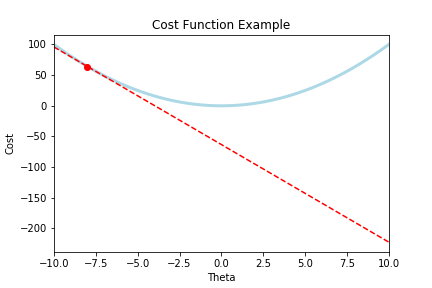

In order to perform the **Gradient Descent** version of **Linear Regression**, we must first understand these ideas:

- Hypothesis equation
- Cost Function
- Gradient Descent
  - Learning rate

## Hypothesis equation

A hypothesis equation is like any equation we learned way back when: $f(x) = mx + b$

In this case, $f(x)$ would be our predicted value, or our **hypothesis**. $m$ and $b$ would be our **parameters**. $x$ would be one of our variables that we would use as part of our **prediction**.

Changing our notation to something more formal, we can think of $f(x)$ as our hypothesis function: $h(x)$. The parameters $m$ and $b$ could be notated as $\theta_{0}$ and $\theta_{1}$. Our variable $x$ could stay the same.

We would therefore have our hypothesis equation: $h(x) = \theta_{1}x + \theta_{0}$.

The purpose of this equation in Linear Regression is that we are trying to find the best hypothesis that most closely represents our actual data.

We are trying to see, what are the best parameters, $\theta_{0}$ and $\theta_{1}$, in the equation $h(x) = \theta_{1}x + \theta_{0}$ that would allow our $h(x)$ (the predicted value) to equal the actual value, which we could call $y$.

In order to do that we must introduce something called the...

## Cost Function

$$
J(\theta) = \frac{1}{2}(h_{\theta}(x) - y)^2
$$

- The cost function can be broken down into 4 steps:

Given a **predicted** value, which is the result of a hypothesis equation

- $h_{\theta}(x)$

and an **actual** value based off of the data:

- $y$,

1. Take the **difference** between the predicted and actual value
2. **Square** the difference
3. **Repeat 1 and 2 for all observations** and sum these values together
4. **Divide** by twice the number of observations

### Cost

This result is equal to the cost of an equation: $J(\theta)$.

You could think of cost like how much error there is between the prediction value of a given hypothesis equation and the actual value.

The goal to finding an optimal $h_{\theta}(x)$ would therefore be to **minimize the cost**.

By minimizing $J(\theta)$, we would therefore minimize how much error there is between the results of our hypothesis equation, and our actual data.

How can we minimize cost to find the optimal hypothesis equation that most accurately fits our data?

## Gradient Descent

Gradient Descent is an algorithm that can be applied in order to minimize the cost.

Intuitively, imagine we have a plot of our cost function that looks like this:


Where the red dot is the cost when our $\theta_{1} = 8$.

The goal is to get our cost $J(\theta)$ to here:


In order to do this, we must use the rate of change where we started, and iteratively move that point to the bottom.

Looking at the rate of change:



Which is that red tangent line (whose slope is our derivative), we can use that term, to move $\theta$ to the bottom.

Remember, when $J(\theta)$ is low, we would now have the optimal parameters, $\theta_{0}$ and $\theta_{1}$ within the the hypothesis equation:

- $h(x) = \theta_{1}x + \theta_{0}$.

that optimally predicts data in relation to the actual data $y$.

Here is the equation to iteratively descend our cost $J(\theta)$:

Repeat until we reach convergence (the bottom)

$
\theta_{j} := \theta_{j} - \alpha\frac{\partial}{\partial\theta_{j}}J(\theta)
$

Lets break this down:

- $ \frac{\partial}{\partial\theta_{j}}J(\theta)$ is the partial derivative of $J(\theta)$ with respect to $\theta_{j}$

  - By taking the partial derivative, we are measuring the rate of change that that specific parameter has (it's slope).

  - So $\frac{\partial}{\partial\theta_{j}}J(\theta)$ is the rate of change that specific parameter $\theta_{j}$ has,
  - this is how we get the slope of this line:
    

- $\alpha$ is the learning rate (how fast we descend).
  - If $\alpha$ is too large, gradient descent fails to descend
  - If $\alpha$ is too small, gradient descent will take tiny steps, and therefore takes a long time to descend.

Our descent begins every time we subtract $ - \alpha\frac{\partial}{\partial\theta_{j}}J(\theta)
$ on every parameter $\theta_{j}$ or every time we subtract our learning rate times the rate of change of every parameter on each parameter.

Our descent ends once $\theta_{j}$ reaches convergence for all $j$ parameters.


- Notice how the rate of change (the slope) of that tangent line is also zero
  - This is how Gradient Descent stops when we reach convergence!
    - Because our term: $\frac{\partial}{\partial\theta_{j}}J(\theta)$ from the equation $\theta_{j} := \theta_{j} - \alpha\frac{\partial}{\partial\theta_{j}}J(\theta)$ is now zero, and therefore there are no more updates on $\theta_{j}$

Once our descent ends, we should have the optimal parameters that best minimizes the cost function $J(\theta)$, and these parameters will go into our hypothesis function $h_{\theta}(x)$ which will now be the best fit equation.

Here is a useful quote from Andrew Ng's Machine Learning course:

> The point of all this is that if we start with a guess for our hypothesis and then repeatedly apply these gradient descent equations, our hypothesis will become more and more accurate.

Once we have our hypothesis equation as accurate as it can be, we have.... a linear regression model.

I also should emphasize that the visualizations for this example are for only 1 $\theta_{j}$. This process would happen for all $\theta_{j}$ parameters in our $h_\theta(x)$ equation. In this example: $\theta_{0}$ and $\theta_{1}$.

If we wanted to calculate all the partial derivatives at once, and in turn, update all parameters $\theta_{j}$, we can use the **gradient** vector, noted as $\nabla_{\theta}J(\theta)$, where $\nabla_{\theta}J(\theta) = \frac{2}{m}X^{T}(X\theta - y)$

Think of the **Gradient** in this context as a vector that holds all the rates of changes for each parameter $\theta_{j}$

And use that to solve for each new $\theta$:

$$
\theta^{next} = \theta - \alpha\nabla_{\theta}J(\theta)
$$

Let's implement this in python!

## Gradient Descent and Linear Regression Python implementation

Putting it all together,

In order to perform linear regression (find the best fit line (best hypothesis) given a set of data points), we apply the gradient descent algorithm described above to find the optimal parameters for our hypothesis equation.

We will start with an equation where we know the parameters in order to generate our data:

```python
import numpy as np
import matplotlib.pyplot as plt

# generate 100 x values between 0 and 2
X = 2 * np.random.rand(100, 1)
# generate y values with some random offset
# from the standard normal distribution
y = 2 + 7 * X + np.random.randn(100, 1)
```

```python
fig = plt.figure()
ax = fig.add_subplot(111)
ax.set(title='Gradient Descent Linear Regression Example',
 ylabel='y', xlabel="X")
ax.scatter(X, y)
```


The code we just wrote would be the same as $Y = 7X_{1} + 2X_{0}$ with some random offset data. Where $X_{0} = 1$, and $X_{1}$ = `X`.

In order to obtain our Matrix $X$, we need to add the $X_{0}$ term to our $X_{1}$ term by concatenating both arrays together.

```python
# concatenate 100 X0s to our 100 X1 values
X_matrix = np.c_[np.ones((100, 1)), X]
```

This `X_matrix` now can fulfill the hypthesis equation with:
$h_{\theta}(X) = \theta X$

Where we take the dot product of $\theta$ and $X$ to calculate $h_{\theta}(X)$.

Remember our gradient descent equation:

$
\theta^{next} = \theta - \alpha\nabla_{\theta}J(\theta)
$

To represent this in Python, we must first calculate $\nabla_{\theta}J(\theta)
$ using this equation:

$\nabla_{\theta}J(\theta) = \frac{2}{m}X^{T}(X\theta - y)$.

Here is a variable name map to our equations map:

- `theta` = $\theta$
- `alpha` = $\alpha$
- `m` = $m$
- `gradients` = $\nabla_{\theta}J(\theta)$

```python
# Learning rate
alpha = 0.1
# How many updates will we  make upon theta
iterations = 1000
# m is the number of observations
m = 100
# randomly initialize our theta values
theta = np.random.randn(2, 1)
```

To calculate $\nabla_{\theta}J(\theta)$ within $\nabla_{\theta}J(\theta) = \frac{2}{m}X^{T}(X\theta - y)$, we will use the function `calculate_gradients`:

```python
def calculate_gradients(m, X, theta, y):
    return 2/m * X.T.dot(X.dot(theta) - y)
```

We will now loop through each iteration, updating our theta parameters accordingly to implement $
\theta^{next} = \theta - \alpha\nabla_{\theta}J(\theta)
$ on every iteration:

```python
for iteration in range(iterations):
    # First calculate the  gradient of our  cost function
    gradients = calculate_gradients(m, X_matrix, theta, y)
    # Now, apply gradient descent by updating theta
    theta = theta - alpha * gradients
```

Our calculated `theta` values become this after gradient descent:

```python
theta
```

    array([[2.21322362],
           [6.82198367]])

Remember when we generated our data? The data was generated with the equation:

$Y = 7X_{1} + 2X_{0}$ `+ offset-term`

Where $\theta_{1}$ = `7` and $\theta_{2}$ = `2`.
Our calculated thetas were $\theta_{1}$ = `6.82` and $\theta_{0}$ = `2.213`.

As you can see, the gradient descent algorithm correctly found the optimal `thetas` to best fit our original data!

Plotting our Linear Regression line with the new theta values:

```python
# defining our hypothesis equation
def h(theta, X):
    return X.dot(theta)
```

```python
fig = plt.figure()
ax = fig.add_subplot(111)
ax.set(title='Gradient Descent Linear Regression Example',
 ylabel='y', xlabel="X")
 # Plot orginal data points
ax.scatter(X, y)
# Plot our linear regression  line
ax.plot(X, h(theta, X_matrix), color='red', linewidth=3)
```


## Gradient Descent and Linear Regression R implementation

Lets first generate the same data as we had done earlier, with 100
random values for `X1` between `0` and `2`, and our equation for `y`:
`y = 2 + 7 * X + random noise`

```r
# Create our X matrix
X0 <- rep(1, times = 100)
X1 <- runif(100, min=0, max=2)
X <- matrix(c(X0, X1), ncol=2)
colnames(X) <- c("X0", "X1")
head(X)
```

```
##      X0        X1
## [1,]  1 1.7752804
## [2,]  1 1.1690086
## [3,]  1 0.6181976
## [4,]  1 0.2648888
## [5,]  1 1.8832422
## [6,]  1 0.2968584
```

We will now use our theta values to create our data

```r
theta0 <- 2
theta1 <- 7
Theta <- matrix(c(theta0, theta1), nrow=2)
row.names(Theta) <- c("theta0", "theta1")
Theta
```

```
##        [,1]
## theta0    2
## theta1    7
```

Next we will implement our hypothesis function

```r
y <- X %*% Theta + rnorm(100)
```

Plotting our sample data

```r
plot(X[,"X1"], y, ylab="y", xlab="x1", main="Sample Data")
```


The next step would be to implement our equations:

$\nabla_{\theta}J(\theta) = \frac{2}{m}X^{T}(X\theta - y)$.

$
\theta^{next} = \theta - \alpha\nabla_{\theta}J(\theta)
$

```r
# Learning rate
alpha = 0.1
iterations = 1000
# number of observations
m = nrow(X)
# randomly choose theta
Theta = matrix(rnorm(2), nrow=2)
rownames(Theta) <- c("theta0", "theta1")
Theta
```

```
##             [,1]
## theta0 1.7300766
## theta1 0.4775213
```

Implement our gradient descent algorithm

```r
print(paste0("Iteration: ", 0,
              "; Theta0 = ", Theta["theta0", ],
              ", Theta1 = ", Theta["theta1", ]))

for(i in 1:iterations) {
  # First calculate the  gradient of our  cost function
  gradients = 2/m * t(X) %*% (X %*% Theta - y)
  # Now, apply gradient descent by updating theta
  Theta = Theta - alpha * gradients
  if (!(i %% 200)) {
    print(paste0("Iteration: ", i,
                  "; Theta0 = ",
                  Theta["theta0", ], ", Theta1 = ", Theta["theta1", ]))
  }
}
```

```
## [1] "Iteration: 0; Theta0 = 1.7300766274575, Theta1 = 0.477521321383724"
## [1] "Iteration: 200; Theta0 = 2.04703159560097, Theta1 = 6.98666808306305"
## [1] "Iteration: 400; Theta0 = 2.04422953417397, Theta1 = 6.98907048177482"
## [1] "Iteration: 600; Theta0 = 2.04422694609763, Theta1 = 6.9890727007095"
## [1] "Iteration: 800; Theta0 = 2.04422694370719, Theta1 = 6.98907270275898"
## [1] "Iteration: 1000; Theta0 = 2.04422694370499, Theta1 = 6.98907270276087"
```

Plotting our line with the calculated thetas

```r
plot(X[,"X1"], y, ylab="y", xlab="x1", main="Sample Data", col="blue")
abline(a=Theta["theta0", 1], b=Theta["theta1", 1], col="red")
```


## Acknowledgements

I am currently taking Andrew Ng's [Machine Learning Course](https://www.coursera.org/learn/machine-learning) on Coursera, this blog has been a summary of parts of the course.

[Hands-On Machine Learning with Scikit-Learn, Keras, and TensorFlow, 2nd Edition](https://www.amazon.com/Hands-Machine-Learning-Scikit-Learn-TensorFlow/dp/1492032646) was another great resource in showing how to implement the theory with `python`.
